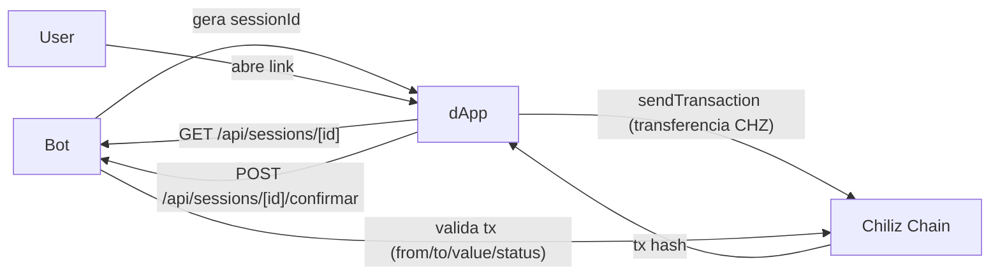

# Palpito — Mini dApp

Mini-site Next.js 14 para os usuarios assinarem suas apostas em CHZ na
Chiliz Chain (Spicy testnet por padrao).

## Stack

- Next.js 14 (App Router)
- wagmi v2 + viem
- RainbowKit v2 (modal de conexao MetaMask/WalletConnect)
- TanStack Query
- Tailwind CSS

## Setup

```powershell
# Na raiz do projeto (um único .env para bot + site)
copy .env.example .env
# edite .env na raiz

cd dapp
npm install
npm run dev
```

O dApp lê o `.env` da **raiz** automaticamente (`dapp/next.config.js`).

`http://localhost:3000` deve abrir a home.

## Variaveis de ambiente

Todas ficam no `.env` da raiz. Principais do site:

| Var | O que e |
|---|---|
| `NEXT_PUBLIC_APP_URL` | URL publica do dApp (Vercel ou local) |
| `NEXT_PUBLIC_NETWORK` | `spicy` (testnet) ou `chiliz` (mainnet) |
| `BOT_API_URL` | URL do bot (proxy `/bot-api` no dev) |
| `NEXT_PUBLIC_BOT_API_URL` | URL publica do bot (mensagens de erro) |
| `NEXT_PUBLIC_DISCORD_GUILD_ID` | Servidor padrao para rodada/ranking |
| `ADMIN_USERNAME` | Usuario do painel Quiz |
| `ADMIN_PASSWORD` | Senha do painel Quiz |
| `AUTH_SECRET` | Assinatura dos cookies de sessao admin |
| `NEXT_PUBLIC_WALLETCONNECT_PROJECT_ID` | id em cloud.walletconnect.com |

## Telas

| Rota | O que faz |
|---|---|
| `/` | Landing simples |
| `/palpites` | Palpite web (salva no mesmo banco do Discord) + ranking + resultados |
| `/aposta/[sessionId]` | Mostra a aposta gerada pelo bot, conecta wallet e envia transferencia CHZ |
| `/vincular-wallet/[token]` | Vincula Discord <-> wallet via assinatura |

## Como liga com o bot



O bot expoe um HTTP API (Fastify) que o dApp consome para buscar dados
das sessoes e confirmar transacoes apos a assinatura.

## Deploy Vercel

```powershell
vercel --prod
```

Lembre de:
1. Configurar as env vars do dApp no painel da Vercel (mesmas do `.env` raiz, seção dApp)
2. Atualizar `DAPP_BASE_URL` e `BOT_API_CORS_ORIGIN` no `.env` do bot com a URL final

## Avisos

- Non-custodial: o dApp nunca toca em chave privada de usuario
- Todas as transacoes acontecem direto na carteira do usuario
- Suporta MetaMask, Coinbase, Trust Wallet e qualquer WalletConnect-compativel
