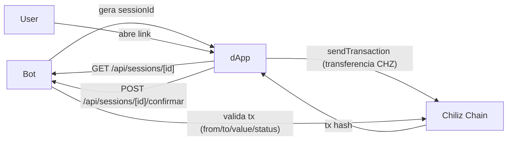

# Palpiter CHZ - Mini dApp

Mini-site Next.js 14 para os usuarios assinarem suas apostas em CHZ na
Chiliz Chain (Spicy testnet por padrao).

## Stack

- Next.js 14 (App Router)
- wagmi v2 + viem
- RainbowKit v2 (modal de conexao MetaMask/WalletConnect)
- TanStack Query
- Tailwind CSS

## Setup

```powershell
cd dapp
npm install
copy .env.example .env.local
# edite .env.local
npm run dev
```

`http://localhost:3000` deve abrir a home.

## Variaveis de ambiente

| Var | O que e |
|---|---|
| `NEXT_PUBLIC_APP_URL` | URL publica do dApp (Vercel ou local) |
| `NEXT_PUBLIC_NETWORK` | `spicy` (testnet) ou `chiliz` (mainnet) |
| `NEXT_PUBLIC_BOT_API_URL` | URL publica do mini HTTP server do bot |
| `NEXT_PUBLIC_DISCORD_GUILD_ID` | Servidor padrao para carregar rodada/ranking no site |
| `NEXT_PUBLIC_WALLETCONNECT_PROJECT_ID` | id em cloud.walletconnect.com |

## Telas

| Rota | O que faz |
|---|---|
| `/` | Landing simples |
| `/palpites` | Palpite web (salva no mesmo banco do Discord) + ranking + resultados |
| `/aposta/[sessionId]` | Mostra a aposta gerada pelo bot, conecta wallet e envia transferencia CHZ |
| `/vincular-wallet/[token]` | Vincula Discord <-> wallet via assinatura |

## Como liga com o bot



O bot expoe um HTTP API (Fastify) que o dApp consome para buscar dados
das sessoes e confirmar transacoes apos a assinatura.

## Deploy Vercel

```powershell
vercel --prod
```

Lembre de:
1. Configurar todas as env vars no painel da Vercel
2. Atualizar `DAPP_BASE_URL` no `.env` do bot principal com a URL final
3. Liberar CORS do bot HTTP para esta origem

## Avisos

- Non-custodial: o dApp nunca toca em chave privada de usuario
- Todas as transacoes acontecem direto na carteira do usuario
- Suporta MetaMask, Coinbase, Trust Wallet e qualquer WalletConnect-compativel
